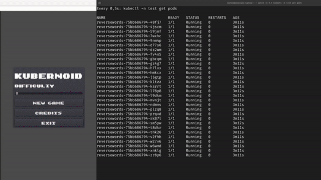

# KuberNoid

Create some chaos in your Kubernetes cluster while playing an arkanoid-like arcade game!

## What is this?

I wanted to learn how Godot can be used to build a simple game, I also love Kubernetes so why not mixing both?

The idea is simple, when the game starts it queries a [server](/server/) to get a list of pods, the server can be configured to return pods from a given namespace, or you can go YOLO and configure it to return pods from all namespaces.

When the game starts you may see bricks of two colors, red and blue. Blue bricks are linked to a given pod so when you break them, a pod will be killed. Red bricks are just fillers.

## Known issues

* Sometimes the ball will bounce with an angle that will make it take too long to reach the bricks
* Exit buttons freeze the game (I believe this is expected)

## Build your own Game Container Image

1. Export the game to HTML5 using the Godot Engine. 
2. Use the Containerfile located [here](/game/Containerfile).

## Deploying the game on your own cluster

1. Create a Namespace for the game

    ~~~sh
    cat <<EOF | kubectl apply -f -
    apiVersion: v1
    kind: Namespace
    metadata:
      name: kubernoid
    EOF
    ~~~

2. Create a ServiceAccount for running the pod

    ~~~sh
    cat <<EOF | kubectl apply -f -
    apiVersion: v1
    kind: ServiceAccount
    metadata:
      name: kubernoid
      namespace: kubernoid
    EOF
    ~~~

3. Create a ClusterRole that allows to list and delete pods

    ~~~sh
    cat <<EOF | kubectl apply -f -
    apiVersion: rbac.authorization.k8s.io/v1
    kind: ClusterRole
    metadata:
      name: kubernoid-podlister
    rules:
    - apiGroups: [""]
      resources: ["pods"]
      verbs: ["get", "watch", "list", "delete"]
    EOF
    ~~~

4. Create a ClusterRoleBinding that allows serviceaccount `kubernoid` to list and delete pods

    ~~~sh
    cat <<EOF | kubectl apply -f -
    apiVersion: rbac.authorization.k8s.io/v1
    kind: ClusterRoleBinding
    metadata:
      name: kubernoid-podlister-global
    subjects:
    - kind: ServiceAccount
      name: kubernoid 
      namespace: kubernoid
    roleRef:
      kind: ClusterRole
      name: kubernoid-podlister
      apiGroup: rbac.authorization.k8s.io
    EOF
    ~~~

5. Create a ConfigMap to configure the PodLister URL

    > **NOTE**: Change the URL where you will publish the Pod Lister service

    ~~~sh
    cat <<EOF | kubectl apply -f -
    apiVersion: v1
    kind: ConfigMap
    metadata:
      creationTimestamp: null
      name: podlisterconfig
      namespace: kubernoid
    data:
      podlister.url: |
        http://podlister.apps.k8s.kubelabs.org
    EOF
    ~~~

6. Create the Deployment for our game

    > **NOTE**: This deployment limits the pod lister to the `test` namespace.

    ~~~sh
    cat <<EOF | kubectl apply -f -
    apiVersion: apps/v1
    kind: Deployment
    metadata:
      name: kubernoid
      namespace: kubernoid
      labels:
        app: kubernoid
    spec:
      replicas: 1
      selector:
        matchLabels:
          app: kubernoid
      template:
        metadata:
          labels:
            app: kubernoid
        spec:
          serviceAccountName: kubernoid
          volumes:
            - name: podlister-config
              configMap:
                name: podlisterconfig
          containers:
          - name: podlister
            image: quay.io/mavazque/kubernoid:podlisterv0
            imagePullPolicy: Always
            args:
            - "-namespace"
            - "test"
            ports:
            - containerPort: 9000
              name: http-podlister
          - name: game
            image: quay.io/mavazque/kubernoid:gamev0
            volumeMounts:
            - name: podlister-config
              mountPath: /opt/KuberNoid/podlister.url
              subPath: podlister.url
            imagePullPolicy: Always
            ports:
            - containerPort: 8000
              name: http-game
    EOF
    ~~~

7. Expose the KuberNoid pod

    ~~~sh
    cat <<EOF | kubectl apply -f -
    apiVersion: v1
    kind: Service
    metadata:
      labels:
        app: kubernoid
      name: kubernoid
      namespace: kubernoid
    spec:
      ports:
      - port: 8000
        protocol: TCP
        targetPort: http-game
        name: http-game
      - port: 9000
        protocol: TCP
        targetPort: http-podlister
        name: http-podlister
      selector:
        app: kubernoid
      type: ClusterIP
    EOF
    ~~~

8. Create an Ingress for our game

    > **NOTE**: Change the URL where you will publish the Pod Lister and Game services

    ~~~sh
    cat <<EOF | kubectl apply -f -
    apiVersion: networking.k8s.io/v1
    kind: Ingress
    metadata:
      name: kubernoid
      namespace: kubernoid
    spec:
      ingressClassName: nginx
      rules:
      - host: kubernoid.apps.k8s.kubelabs.org
        http:
          paths:
          - backend:
              service:
                name: kubernoid
                port:
                  number: 8000
            path: /
            pathType: Prefix
      - host: podlister.apps.k8s.kubelabs.org
        http:
          paths:
          - backend:
              service:
                name: kubernoid
                port:
                  number: 9000
            path: /
            pathType: Prefix
    EOF
    ~~~

## Credits

The game assets have been downloaded from several sites, you can check the list here and in-game.

* [Breakout Assets](https://megacrash.itch.io/breakout-assets)
* [Sound Effects](https://opengameart.org/content/8-bit-retro-sfx)
* [Fonts](https://www.dafont.com/es/8-bit-arcade.font)
* [Icons](https://hugo4it.itch.io/nice-pack)